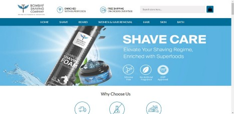
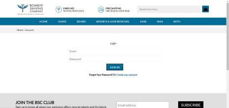
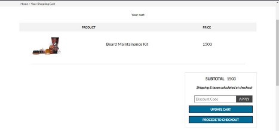
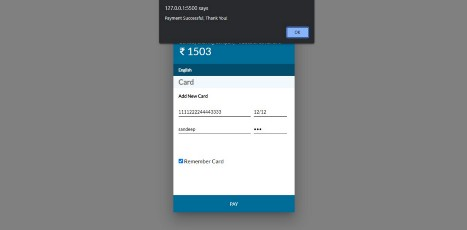

# Bombay Shaving Company Clone
This project is made for educational purpose

## About Us
In the course of the second unit here at Masai School, we learned HTML and CSS along with JS DOM, Constructor functions, Prototype and Inheritance, the usage of local storage and client Server Model, Asynchronous Programming, and Promises.

At the end of our second unit, we were given a project as a part of our curriculum. We are assigned a website to clone as a construct week project. In this project we have to use all the skills we have learned till now. I had to clone [Bombay Shaving Company](https://bombayshavingcompany.com/).

## About Bombay shaving company
This website is basically a eCommerce website which have lot of products related to men grooming & shaving. In our clone, we have tried to cover all the important functionalities and pages one would find over there.

## Tech Stacks Used
- HTML
- CSS
- JavaScript

## Functionality of the Project
1. Landing Page which is exactly the replica of the original website.
2. Login page.
3. Product page display the products in the form of grid and flex.
4. Add to cart page where you can add the product you want to buy.
5. Payment gateway.

## Glimes Of my project

1. Landing Page

2. Login page

3. Product Page

4. Cart page

5. Payment Page

